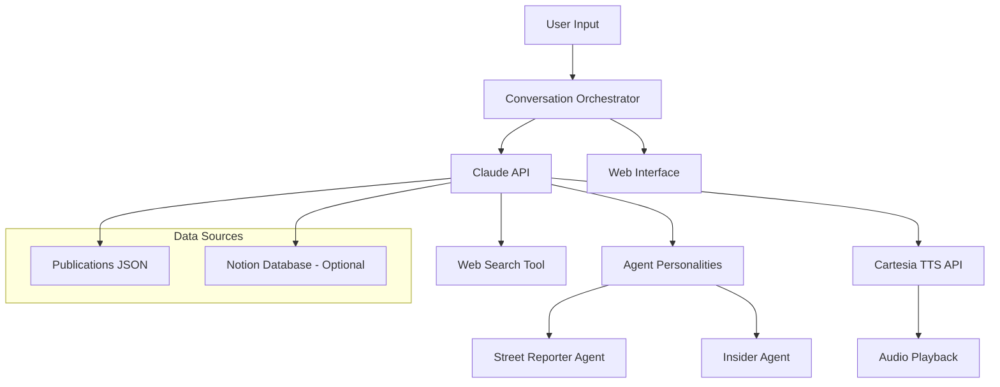

# Media Ownership Voice Agents Implementation Plan

## Architecture Overview

The system consists of four main components working together:




## ~~Phase 0.5: Critical API Smoke Test (30 minutes)~~ DONE

~~Create `test_basic.py` to verify both APIs work before building anything.~~

- ~~Claude API: PASSING (claude-sonnet-4-20250514)~~
- ~~Cartesia API: PASSING (601 voices, TTS generation via sonic-2)~~
- ~~Cartesia SDK v2 quirks captured: `voice={"id": ...}`, `tts.bytes()` returns Iterator~~

## ~~Phase 1: Core Text-Based MVP (4 hours)~~ DONE

- ~~Project structure, venv, dependencies~~ DONE
- ~~`data/publications.json` with 5 publications (WaPo, Fox, CNN, NYT, WSJ)~~ DONE -- rich dataset with Ground News ratings, conflicts, controversies, voice agent angles
- ~~`migrate_to_notion.py` -- migrated all 5 publications to Notion database~~ DONE
- ~~`src/agents/street_reporter.py` -- STREET_REPORTER_PROMPT~~ DONE
- ~~`src/agents/insider.py` -- INSIDER_PROMPT~~ DONE
- ~~`src/claude_client.py` -- Claude API wrapper~~ DONE
- ~~`src/orchestrator.py` -- conversation coordinator with turn-taking~~ DONE
- ~~Tested: WaPo conversation with distinct personalities~~ DONE

**Key decisions made:**

- Agent prompts are string constants, passed to Claude's `system` parameter
- Ground News cited as source for bias/factuality (referenced naturally, not forced)
- Orchestrator supports interactive menu or CLI pub ID (`wapo`, `fox`, `cnn`, `nyt`, `wsj`)
- 4 exchanges per conversation (8 total turns)

## ~~Phase 2: Voice Integration with Cartesia (3 hours)~~ DONE

- ~~Voice selection from Cartesia library (601 voices)~~ DONE
  - ~~Reporter: American voice (CARTESIA_VOICE_REPORTER in .env)~~ DONE
  - ~~Insider: British voice (CARTESIA_VOICE_INSIDER in .env)~~ DONE
  - ~~Multiple voice iterations tested before finalizing~~ DONE
- ~~`src/cartesia_client.py` -- TTS client with per-agent voice IDs~~ DONE
- ~~`text_to_speech()` and `generate_conversation_audio()` functions~~ DONE
- ~~Audio output as WAV files, saved to `audio_output/` and `demo/audio/~~` DONE
- ~~Integrated into orchestrator via `--audio` flag~~ DONE

## ~~Phase 3: Web Search + Notion Integration (4 hours)~~ DONE

- ~~Claude `web_search_20250305` tool enabled in `claude_client.py~~` DONE
  - ~~Agents pull real-time ownership data (e.g. found $3.3B Murdoch buyout, WaPo layoffs, Bezos/Hegseth meeting)~~ VERIFIED
- ~~Notion database created and populated (5/5 publications via `migrate_to_notion.py`)~~ DONE
- ~~`src/notion_client.py` -- reads from Notion database, formats context for agents~~ DONE
- ~~Orchestrator enriches conversations with both Notion baseline + live web search~~ DONE
- ~~Dual-source responses verified: agents cite structured data and current events~~ DONE
- ~~`--web-search` flag added to orchestrator~~ DONE

## ~~Phase 4: Web Interface and Demo Polish (5 hours)~~ IN PROGRESS

### 4.1 Web Interface -- DONE

- ~~`server.py` -- FastAPI backend serving UI + API endpoints~~ DONE
- ~~`web/index.html` -- editorial layout with character images~~ DONE
- ~~`web/style.css` -- minimal, paper cut-out style inspired by Universe S/S, lobsteranatomy.com, Benjamin Edgar~~ DONE
- ~~`web/app.js` -- publication selector, conversation renderer, audio playback queue~~ DONE
- ~~Character images: Andrew (reporter), FJ (insider) as paper cut-outs~~ DONE
- ~~Pre-baked WaPo demo conversation with audio loads instantly~~ DONE
- ~~Live investigation generation via POST `/api/investigate/{pub_id}~~` DONE
- ~~Per-turn and full conversation audio playback with visual highlighting~~ DONE

### 4.2 Demo Preparation -- PARTIALLY DONE

- ~~Pre-baked WaPo demo saved to `demo/wapo_conversation.json` with audio~~ DONE
- 3-minute presentation script (remaining)
- Demo video recording (remaining)

### 4.3 Documentation and Open Source -- REMAINING

- README with setup instructions
- MIT license
- GitHub repository setup

## Progress Summary

- ~~**Phase 0.5**: API Smoke Test~~ DONE
- ~~**Phase 1**: Text MVP~~ DONE
- ~~**Phase 2**: Voice Integration~~ DONE
- ~~**Phase 3**: Web Search + Notion~~ DONE
- **Phase 4**: Polish + Demo -- IN PROGRESS (UI done, demo prep + docs remaining)

## Technical Implementation Details

### Key Dependencies

```txt
anthropic>=0.25.0
cartesia>=1.0.0
python-dotenv>=1.0.0
fastapi>=0.100.0
uvicorn>=0.20.0
requests>=2.31.0
```

### Environment Configuration

```env
ANTHROPIC_API_KEY=your_claude_key_here
CARTESIA_API_KEY=your_cartesia_key_here
NOTION_API_KEY=your_notion_key_here
NOTION_PARENT_PAGE_ID=your_page_id_here
NOTION_DATABASE_ID=your_database_id_here
```

### Core API Integrations

- **Claude API**: `claude-sonnet-4-20250514` with `web_search_20250305` tool
- **Cartesia TTS**: `sonic-2` model, WAV output, per-agent voice IDs via .env
- **Notion**: Read via `notion_client.py` using httpx + Notion-Version 2022-06-28
- **Web Search**: Claude built-in, max 3 searches per turn

## Success Metrics

### Minimum Viable Demo

- Two agents discuss 1 publication with distinct voices
- Audio playback works smoothly
- Shows clear personality differences
- Runs without critical errors

### Competitive Demo

- Handles all 5 publications
- Uses real-time web search effectively
- Professional web interface
- Clear demonstration of all 3 problem statements

### Winning Demo

- All competitive features plus:
- Novel insights about media ownership implications
- Notion integration bonus points
- Production-ready code quality
- Compelling narrative about media transparency
- Strong potential for real-world application

## Risk Mitigation

### Technical Risks

- **API Rate Limits**: Implement caching and request throttling
- **Audio Latency**: Pre-generate common responses, use streaming
- **Web Search Reliability**: Fallback to curated dataset if search fails

### Timeline Risks

- **Scope Creep**: Focus on MVP first, add features incrementally
- **API Issues**: Test all integrations early, have backup plans
- **Demo Failures**: Prepare recorded backup demo for presentation

