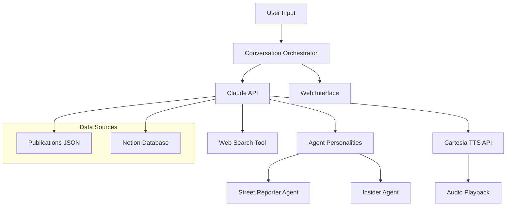

# Media Ownership Voice Agents - "Follow the Money"

Two AI voice agents with distinct personalities discuss media ownership structures using real-time data.

**Hackathon Problem Statements:** Expressive + Advanced Reasoning + Situationally Aware + Notion Bonus Track

---

## Architecture



## File Structure

```
media-agents/
├── PLAN.md                        # This file
├── README.md                      # Project documentation
├── requirements.txt               # Python dependencies
├── .env                           # API keys (git-ignored)
├── .env.example                   # Template for API keys
├── .gitignore                     # Git ignore rules
├── test_basic.py                  # API smoke test (PASSING)
├── migrate_to_notion.py           # Notion database migration script
├── data/
│   └── publications.json          # 5 publications dataset (rich, with Ground News ratings)
├── src/
│   ├── __init__.py
│   ├── agents/
│   │   ├── __init__.py
│   │   ├── street_reporter.py     # Agent 1 system prompt (DONE)
│   │   └── insider.py             # Agent 2 system prompt (DONE)
│   ├── orchestrator.py            # Main conversation coordinator (DONE)
│   ├── cartesia_client.py         # TTS integration (TODO)
│   └── claude_client.py           # Claude API wrapper (DONE)
├── web/
│   ├── index.html                 # Frontend interface
│   ├── style.css                  # Styling
│   └── app.js                     # Client-side logic
└── demo/
    └── demo_script.md             # Presentation notes
```

---

## Timeline (16 hours)

### Phase 0.5: API Smoke Test (30 min) -- DONE

**Goal:** Verify Claude and Cartesia APIs work before building anything.

- [x] Create `test_basic.py`
- [x] Test Claude API connection + basic message (claude-sonnet-4-20250514)
- [x] Test Cartesia API connection + voice listing (601 voices available)
- [x] Test Cartesia TTS audio generation (sonic-2 model, WAV output)
- [x] Confirm both APIs return successful responses

**Cartesia SDK v2 findings** (captured for Phase 2):
- `client.tts.bytes()` returns `Iterator[bytes]` -- use `b"".join(chunks)`
- Voice parameter: `voice={"id": "voice_id_here"}` (not `voice_id=`)
- Model: `sonic-2`
- Output format: `{"container": "wav", "sample_rate": 44100, "encoding": "pcm_s16le", "bit_rate": 128000}`

### Phase 1: Text MVP (4 hours) -- DONE

**Goal:** Two agents discussing media ownership in text format.

- [x] Set up project structure, venv, dependencies
- [x] Create `data/publications.json` with 5 publications (rich dataset with Ground News ratings, conflicts, controversies, agent angles)
- [x] Migrate publications to Notion database (`migrate_to_notion.py`)
- [x] Write Street Reporter system prompt (`src/agents/street_reporter.py`)
- [x] Write Insider system prompt (`src/agents/insider.py`)
- [x] Build orchestrator with turn-taking logic (`src/orchestrator.py`)
- [x] Build Claude API wrapper (`src/claude_client.py`)
- [x] Test: two agents discuss Washington Post with distinct personalities -- VERIFIED WORKING

**Key decisions:**
- Agent prompts are string constants, passed to Claude's `system` parameter
- Ground News cited as source for bias/factuality ratings (referenced naturally, not forced)
- Orchestrator supports interactive menu or CLI pub ID (`wapo`, `fox`, `cnn`, `nyt`, `wsj`)
- 4 exchanges per conversation (8 total turns)

### Phase 2: Voice Integration (3 hours) -- NEXT

**Goal:** Convert text responses to speech with distinct voices.

- [ ] Browse https://play.cartesia.ai/voices and select voice_ids
  - Street Reporter: Confident, clear, authoritative
  - Insider: Playful, cheeky, conversational
- [ ] Build Cartesia TTS client (`src/cartesia_client.py`)
- [ ] Integrate TTS into orchestrator pipeline
- [ ] Test audio playback for both agents

**Success Criteria:**
- Both agents have distinct, personality-appropriate voices
- Audio plays smoothly
- Personality comes through in voice tone

### Phase 3: Web Search + Notion (4 hours)

**Goal:** Make agents situationally aware with live data + Notion bonus.

- [ ] Enable Claude `web_search` tool for real-time ownership data
- [ ] Enhanced agent prompts for source citation
- [x] Set up Notion database with ownership data (5/5 publications migrated)
- [x] Connect Notion integration with read/write access
- [ ] Integrate dual-source responses (Notion + web search)

**Success Criteria:**
- Agents find and cite current ownership information
- Notion database serves structured data
- Web search validates and updates information
- Demonstrates "situationally aware" requirement
- Notion bonus track completed

### Phase 4: Polish + Demo (5 hours)

**Goal:** Create compelling demo for judges.

- [ ] Build web interface (lobster anatomy-inspired design)
  - Publication selector
  - Real-time conversation display
  - Audio player with agent labels
- [ ] Prepare demo scenarios:
  - "Who really owns The Washington Post?" (Bezos/Amazon)
  - "How does the Murdoch family control Fox News?" (Trust dynamics)
- [ ] 3-minute presentation script
- [ ] README, MIT license, GitHub documentation
- [ ] Demo video recording

**Success Criteria:**
- Professional demo interface
- All 3 problem statements demonstrated
- Notion bonus track showcased
- Clean open-source repository

---

## Tech Stack

| Component | Technology | Purpose |
|-----------|-----------|---------|
| Brain | Claude API (`claude-sonnet-4-20250514`) | Agent responses, reasoning, web search |
| Voice | Cartesia TTS (`sonic-english`) | Text-to-speech with distinct voices |
| Data | Publications JSON + Notion | Curated ownership facts |
| Frontend | HTML + CSS + JS | Conversation display + audio player |
| Backend | Python + FastAPI | Orchestration + API serving |

## API Keys Required

```
ANTHROPIC_API_KEY  - https://console.anthropic.com/
CARTESIA_API_KEY   - https://play.cartesia.ai/console
NOTION_API_KEY     - https://www.notion.so/my-integrations
```

---

## Risk Mitigation

- **API failures:** Smoke test catches issues early; fallback to curated dataset
- **Audio latency:** Use streaming; cache common responses
- **Rate limits:** Implement request throttling
- **Scope creep:** MVP first, add features incrementally
- **Demo failures:** Prepare recorded backup demo

## Resources

- Claude API Docs: https://docs.anthropic.com/
- Cartesia TTS Docs: https://docs.cartesia.ai/build-with-cartesia/tts-models/latest
- Cartesia Voices: https://play.cartesia.ai/voices
- Notion Hackathon Guide: https://notion.notion.site/Notion-MCP-Resources-Hackathon-Guide-2f8efdeead0580b58406f889305245b4
- Hackathon Rules: https://notion.notion.site/Hacker-Resources-Cartesia-x-Anthropic-Voice-Agents-Hackathon-hosted-by-Notion-2e0efdeead0580918bafe1b5cea8504e
- Lobster Anatomy (UI inspo): https://lobsteranatomy.com/
